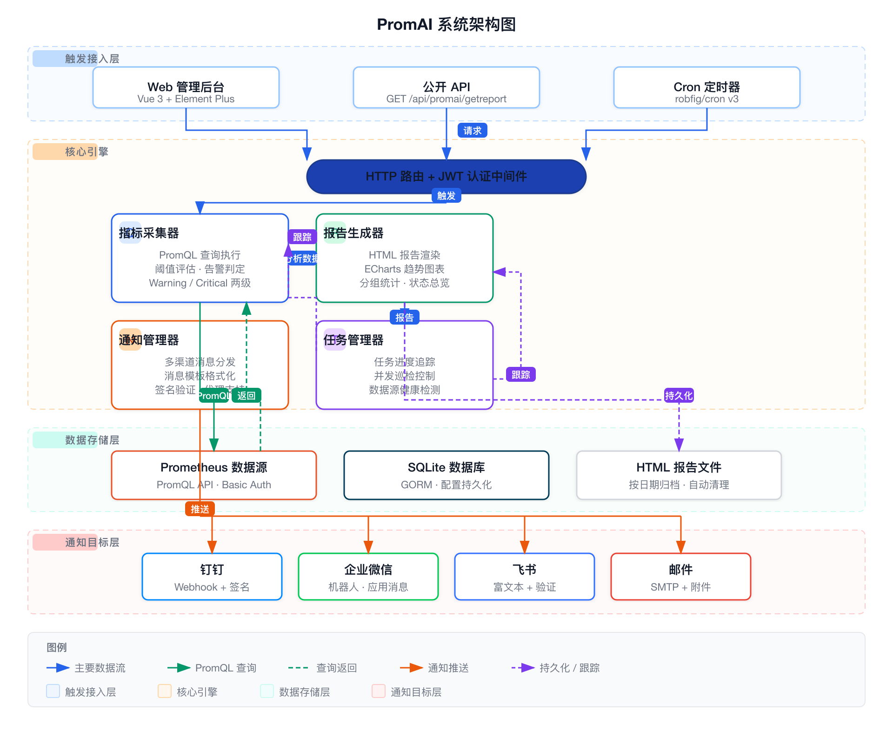

# PromAI — Prometheus 自动化巡检与报告系统

## 概述

PromAI（Prometheus Automated Inspection）是一个基于 Prometheus 的自动化监控巡检与报告生成系统。它通过 PromQL 从 Prometheus 实例采集指标数据，依据可配置的阈值进行健康分析，生成可视化的 HTML 巡检报告，并通过钉钉、企业微信、飞书、邮件等渠道发送通知。

项目地址：<https://github.com/kubehan/PromAI>

---

## 为什么需要 PromAI？

### 运维巡检的常见痛点

**巡检沦为"体力活"**
每天早上打开 Grafana，挨个 Dashboard 截图，拼到 Word/Excel 里，再发邮件。这套流程每天重复，耗时 15~30 分钟，遇到多集群、多团队时工作量翻倍增长。

**告警洪水中漏掉关键信息**
Prometheus + Alertmanager 的告警是单条的，一条 CPU 高、一条磁盘满、一条 Pod 重启——缺乏聚合视图。故障链的全貌是什么？影响范围有多大？没有一份**结构化的巡检报告**很难说清楚。

**多集群管理各自为政**
每个 Prometheus 独立运维，没有统一的健康看板。A 集群挂了半小时可能都没人发现，因为团队只盯着自己负责的那个 Grafana。

**巡检标准不统一**
生产环境、预发环境、测试环境该检查哪些指标？阈值设多少？各团队各自约定，新人来了全靠口口相传。

### PromAI 带来的改变

| 之前 | 之后 |
|------|------|
| 运维每天手动查指标、截图表、写报告，耗时 15~30 分钟 | 系统自动采集、分析、生成报告，零人工介入 |
| 告警散落在钉钉/企微/邮件，缺乏聚合视角 | 一份报告汇集所有检查结果，健康状态一目了然 |
| 多 Prometheus 各自管理，缺少统一入口 | 在 PromAI 一个页面管理所有数据源，支持批量操作 |
| 巡检范围全靠经验，新老运维水平参差 | 模板化管理，指标阈值标准化，新人也能跑完整巡检 |
| 出问题后才去查历史数据 | 每天自动报告，趋势图表提前暴露风险 |

---

## 系统架构



### 架构分层说明

PromAI 采用四层架构设计，自顶向下分为接入层、核心引擎、存储层和通知目标层：

#### 1. 触发与接入层

系统的触发来源有三个：

- **管理员 Web 界面**：基于 Vue 3 + Element Plus 构建的 SPA 管理后台，通过 JWT 认证的 REST API 管理所有配置和触发巡检
- **公开 API 调用**：无需认证的 `GET /api/promai/getreport` 接口，方便被外部系统（CI/CD、其他运维平台）集成调用
- **Cron 定时调度**：基于 `robfig/cron v3` 的内置定时器，支持 Cron 表达式自由定义巡检频率

所有请求统一经过 **HTTP 路由 + JWT 认证中间件** 进行路由分发和鉴权。

#### 2. 核心引擎

核心引擎包含四个协作模块：

| 模块 | 职责 | 关键技术点 |
|------|------|-----------|
| **指标采集器** | 执行 PromQL 查询、阈值评估、健康分析 | `client_golang` v1 API，支持 greater/less/equal 等 6 种比较运算符，两级告警（Warning 90% / Critical 100%） |
| **报告生成器** | HTML 报告渲染、ECharts 趋势图表、分组统计 | Go `html/template` 渲染，ECharts 6 折线图展示 CPU/内存/磁盘趋势，按 Labels 分组统计 min/max/avg |
| **通知管理器** | 多渠道消息分发、消息模板格式化、签名验证 | 支持钉钉 HMAC-SHA256、飞书签名验证、企微邮箱→UserID 转换；所有渠道支持 HTTP 代理 |
| **任务管理器** | 任务进度追踪、并发巡检控制、数据源健康检测 | 内存任务状态跟踪 + SQLite 持久化记录；goroutine 并发执行，WaitGroup 协调；巡检前 10s 超时健康检测 |

#### 3. 数据存储层

- **Prometheus 数据源**：作为被巡检目标，支持 Basic Auth 认证，通过 PromQL API 暴露指标
- **SQLite 数据库**：通过 GORM 持久化所有配置（数据源、指标、模板、通知渠道、定时任务、巡检记录）
- **HTML 报告文件**：按 `inspection_report_YYYYMMDD_HHMMSS.html` 格式存储，支持按保留天数自动清理

#### 4. 通知目标层

| 目标 | 协议 | 特性 |
|------|------|------|
| 钉钉 | 自定义机器人 Webhook | Markdown 消息，HMAC-SHA256 签名 |
| 企业微信 | 机器人 Webhook + 自建应用 | 机器人 Markdown 消息；应用消息自动邮箱→UserID 映射 |
| 飞书 | 自定义机器人 Webhook | 富文本消息（post），可选签名验证 |
| 邮件 | SMTP with TLS | HTML 内容 + 报告文件附件 |

### 核心数据流

1. **触发**：Web 界面 / API 调用 / Cron 触发巡检任务
2. **路由**：HTTP 路由分发请求，JWT 中间件校验（管理接口）
3. **采集**：指标采集器并发向所有目标 Prometheus 发起 PromQL 查询
4. **查询**：Prometheus 返回指标样本数据（series + value）
5. **分析**：采集器将结果与阈值比对，生成健康状态（normal / warning / critical）
6. **生成**：报告生成器将分析结果渲染为 HTML 页面，嵌入 ECharts 趋势图
7. **存储**：报告持久化为时间戳命名的 HTML 文件
8. **通知**：通知管理器将报告摘要推送到所有已配置的渠道

---

## 核心功能

### 1. 多数据源管理

支持添加多个 Prometheus 数据源，统一在一个界面管理和巡检。

- 支持 Basic Auth 认证
- 支持一键启用/禁用
- 支持批量操作：批量启用、批量删除、批量设置模板、批量触发巡检
- 支持从外部 API 自动同步数据源列表（含 JSONPath 提取和自定义 Header）
- 支持 YAML 批量导入

**运维价值**：无论管理 1 个还是 50 个 Prometheus，统一入口、批量操作，告别手动切换上下文。

### 2. 7 层监控分类

PromAI 内置了 7 层监控体系，覆盖基础设施到应用服务的全栈巡检：

| 层级 | 范围 | 指标示例 |
|------|------|---------|
| L1 基础设施 | CPU / 内存 / 磁盘 / IO | `node_cpu_seconds_total`, `node_memory_MemAvailable_bytes` |
| L2 网络 | 丢包率、连接数 | `node_network_drop_total`, `node_netstat_Tcp_CurrEstab` |
| L3 容器与 K8s | 节点、Pod、etcd、CoreDNS、Ingress | `kube_node_status_condition`, `etcd_server_heartbeat_send_failed_total` |
| L4 中间件 | MongoDB / MySQL / Redis / PostgreSQL | `mongodb_connections`, `mysql_global_status_threads_connected` |
| L5 API 网关 | Kong / HAProxy / Nginx | `kong_nginx_http_current_connections`, `haproxy_server_up` |
| L6 应用服务 | 自定义应用指标 | 用户自定义 PromQL |
| L7 采集层 | Exporter 健康状态 | `up` 指标 |

每个指标配置包含：
- **名称**：指标的中文标识
- **描述**：指标含义说明
- **PromQL**：查询语句，支持 PromQL 模板变量 `$datasource`（自动替换为数据源名称）
- **阈值**：与比较运算符组合使用
- **比较运算符**：`greater` / `less` / `equal` / `not_equal` / `greater_equal` / `less_equal`
- **单位**：如 `%`、`bytes`、`count` 等
- **Labels**：附加标签，用于报告分组统计

**运维价值**：一次配置，持续复用。新环境上线只需要绑定模板即可获得完整的巡检覆盖，不再依赖个人经验。

### 3. 两级阈值告警

每个指标支持两级告警：

- **Warning**：当指标值达到阈值的 90% 时触发，提前预知风险
- **Critical**：当指标值达到或超过阈值时触发，及时响应故障

阈值级别可在指标配置中自定义为 `critical`、`warning` 或 `normal`，系统自动计算告警等级。

**运维价值**：Warning 给运维预留缓冲时间——看到磁盘 90% 时还有机会清理，而不是等到 100% 才告警。

### 4. 巡检模板

模板功能允许将指标组合成不同的巡检范围：

- 创建命名模板
- 为模板绑定任意指标配置
- 支持模板级指标覆盖（不修改全局指标配置）
- 一个数据源可以绑定一个模板
- 不同环境（生产/预发/测试）使用不同模板

**运维价值**：
- 生产环境：全量指标检查，阈值严格
- 预发环境：核心指标，阈值宽松
- 测试环境：只检查 Exporter 是否存活

模板化让巡检策略可复用、可版本管理，新人接手也不会漏检。

### 5. 定时任务

基于 Cron 表达式的定时巡检调度：

- 通过 Web 管理后台创建/编辑/删除定时任务
- 每个任务可指定目标数据源和通知渠道
- 支持并发巡检（多个数据源同时执行，任一成功即标记为成功）
- 巡检前自动检测数据源可达性，不可达的数据源会跳过并记录

**运维价值**：设定一次，永久运行。每天早 9 点自动巡检、生成报告、推送到群——睡醒打开手机就知道线上健康状态。

### 6. 报告生成

每次巡检生成一份完整的 HTML 报告，包含以下内容：

- **数据源健康总览**：正常 / Warning / Critical 数量统计
- **指标详细检查结果**：每个指标的实际值、阈值、状态
- **趋势图表**：CPU 使用率、内存使用率、磁盘使用率的 ECharts 折线图
- **分组统计**：按 Labels 分组计算最大/最小/平均值及告警数
- **报告元数据**：生成时间、持续时间、数据源名称

报告以 `inspection_report_YYYYMMDD_HHMMSS.html` 格式存储，支持自动清理（按文件保留天数）。

**运维价值**：趋势图表比单一告警更有价值——CPU 是从昨天开始缓慢爬升还是瞬间飙高？趋势图一秒看懂，定位问题时间从小时级降到分钟级。

### 7. 多渠道通知

报告生成后自动推送到配置的渠道：

| 渠道 | 支持内容 | 说明 |
|------|---------|------|
| 钉钉 | Markdown 消息 | 支持 HMAC-SHA256 签名验证 |
| 企业微信机器人 | Markdown 消息 | 支持 Webhook URL 配置 |
| 企业微信应用 | 文本消息 | 自动通过邮箱匹配 UserID，支持报告链接 |
| 飞书 | 富文本消息 | 支持签名验证 |
| 邮件 | HTML + 附件 | SMTP with TLS，报告以文件附件发送 |

所有渠道支持 HTTP 代理配置。

**运维价值**：一份报告同步推送到多个渠道——运维群、研发群、管理层邮箱，同一份数据各取所需，不用谁转发给谁。

### 8. PromQL 在线校验

Web 管理后台提供 PromQL 校验功能：

- 输入 PromQL 语句，选择数据源
- 返回查询结果样本数据
- 显示返回的标签名和结果类型
- 快速验证 PromQL 语法和结果

**运维价值**：配置新指标时不用切到 Prometheus UI 反复调试，直接在 PromAI 里写完验证，一次通过。

### 9. 健康仪表盘

内置 Dashboard 展示以下统计信息：

- **各数据源健康评分**：以分数形式展示每个数据源的健康状况
- **指标分布**：正常 / Warning / Critical 数量比例
- **告警统计**：告警总数及按数据源的分布
- **健康趋势**：最近 7 天的健康变化曲线

**运维价值**：早上到工位，打开仪表盘扫一眼——10 个数据源全部绿色，可以安心去干别的。不用逐个登录 Prometheus 排查。

### 10. 报告历史与任务管理

- 报告历史列表：分页展示，支持按数据源、状态筛选
- 任务进度追踪：实时查看巡检任务的执行进度
- 最近活动记录：展示系统最近的巡检活动

**运维价值**：月初复盘时，翻出历史报告就能做趋势分析，不用从 Grafana 一张张截图。

---

## API 接口

### 公开接口（无需认证）

| 接口 | 方法 | 说明 |
|------|------|------|
| `/api/promai/getreport` | GET | 触发巡检并生成报告，支持参数 `datasource`、`wechat_bot_key`、`taskid` |
| `/api/promai/getreports` | GET | 获取历史报告列表 |
| `/api/promai/status` | GET | 实时健康状态页面 |
| `/api/promai/progress` | GET | 任务进度追踪页面 |
| `/api/promai/reports/history` | GET | 历史报告页面 |
| `/api/promai/login` | POST | 管理员登录，获取 JWT Token |

### 管理接口（需 JWT 认证）

所有 `/api/promai/admin/*` 接口需要请求头携带 `Authorization: Bearer <token>`。

| 资源 | 端点 | 说明 |
|------|------|------|
| 数据源 | `/api/promai/admin/datasources` | CRUD + 批量操作 + 同步 |
| 指标类型 | `/api/promai/admin/metrics/types` | 指标分类管理 |
| 指标配置 | `/api/promai/admin/metrics/configs` | 指标 CRUD |
| 巡检模板 | `/api/promai/admin/templates` | 模板 CRUD + 绑定指标 + 覆盖 |
| 通知渠道 | `/api/promai/admin/notifications` | 通知配置 + 测试发送 |
| 定时任务 | `/api/promai/admin/cronjobs` | 定时任务 CRUD |
| 报告记录 | `/api/promai/admin/report-records` | 报告管理 + 清理 |
| 系统设置 | `/api/promai/admin/settings` | 应用级别 KV 设置 |
| 仪表盘 | `/api/promai/admin/dashboard/*` | 统计与趋势数据 |
| 同步源 | `/api/promai/admin/sync-sources` | 外部数据源同步配置 |

---

## 部署方式

### Docker Compose（推荐）

```bash
git clone https://github.com/kubehan/PromAI.git
cd PromAI
docker compose up -d
```

### Docker

```bash
docker run -d \
  -p 8081:8081 \
  -v ./config.yaml:/app/config/config.yaml \
  -v ./promai.db:/app/promai.db \
  -v ./reports:/app/reports \
  ghcr.io/kubehan/promai:latest
```

### Kubernetes

项目提供 K8s 部署清单 `deploy/deployment.yaml`：
- 支持 ConfigMap 挂载配置文件
- 支持 PVC 持久化报告数据
- 可根据需要调整副本数

### 二进制直接运行

从 [GitHub Releases](https://github.com/kubehan/PromAI/releases) 下载对应平台的二进制文件：

```bash
# Linux / macOS / Windows 均支持
./promai
```

### 环境变量

| 变量 | 说明 |
|------|------|
| `PROMETHEUS_URL` | 默认 Prometheus 地址 |
| `PROMETHEUS_BASIC_AUTH_USER` | Basic Auth 用户名 |
| `PROMETHEUS_BASIC_AUTH_PASS` | Basic Auth 密码 |
| `DB_PATH` | SQLite 数据库路径 |
| `EXTERNAL_PORT` | 外部访问端口 |
| `JWT_SECRET` | JWT 签名密钥 |

---

## 配置说明

启动后首次运行会自动读取 `config/config.yaml` 并初始化 SQLite 数据库。之后的配置管理全部通过 Web 管理后台操作，不再依赖 YAML 文件。

config.yaml 的完整结构包含：

- **数据源列表**：Prometheus URL、认证信息、标签
- **指标类型和配置**：7 层分类、PromQL、阈值、单位
- **通知通道**：钉钉、企业微信、飞书、邮件的连接信息
- **认证配置**：管理员用户名、密码、JWT Secret
- **Cron 配置**：定时巡检表达式
- **清理策略**：报告保留天数

---

## 技术栈

| 组件 | 技术选型 |
|------|---------|
| 后端语言 | Go 1.22 |
| Web 框架 | net/http（标准库） |
| 数据库 | SQLite + GORM |
| 前端 | Vue 3 + TypeScript + Element Plus |
| 图表 | ECharts 6 + vue-echarts |
| 定时调度 | robfig/cron v3 |
| Prometheus 客户端 | client_golang v1 |
| 部署 | Docker、Kubernetes、二进制分发 |
| CI/CD | GitHub Actions、GoReleaser |
